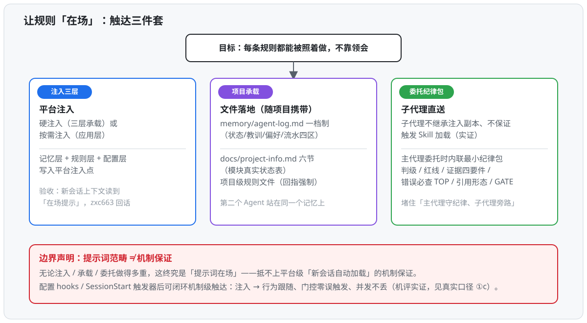
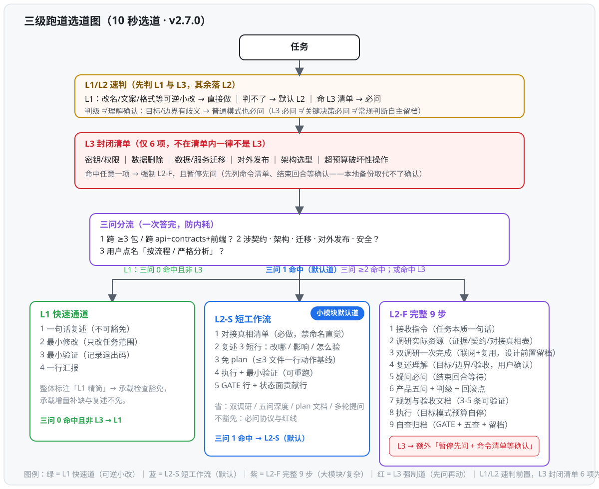
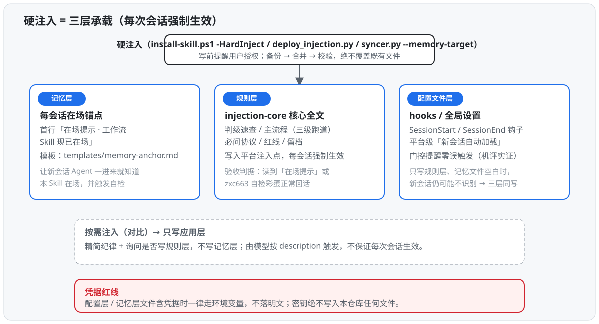

# Shisan Xinuo Agent Workflow · 十三希诺 Agent 工作流

> **渐进式工程治理 Skill——不是把整本手册砸进上下文，而是像神经系统：只在任务到达某一步骤时，注入那一步所需的少量规则。**
> A progressive, on-demand engineering-governance Skill: injects only the few rules a step needs, when that step arrives.

  

> **作者的话 · A word from the author**
>
> 本仓库实质上就是一个**规范工程化的大模型 Agent 提示词注入标范与标本合集**——一份「超长 System Prompt」的工程化样本：把治理规范做成可渐进加载的提示词文件树，你可以直接拿它当**工作流样本**来打磨自己的 Agent 工程规范。**一个必须直面的边界**：哪怕触达上做了重重努力（注入三层 / 项目承载 / 委托纪律包 / hooks 纪律包），这终究是**提示词范畴**——配置平台触发器（hooks / SessionStart）后机制级触达可闭环（机评路测机器实证：注入→行为跟随、门控零误触发、并发不丢），未配置时「提示词在场」≠「机制在场」。**验收判据（可执行）**：新会话常驻不可用，或自检彩蛋 `zxc663` 未触发 → 即证明本 Skill 需要用户主动触发或配置触发器，别把「提示词在场」误当「机制在场」。感谢加星 ⭐。
>
> *At its core this repo is a specimen collection of disciplined, engineering-grade prompt-injection standards for LLM agents — use it as a sample workflow to polish your own. After v2.0.5 expect stable, fine-grained updates; no breaking releases planned (but no hard guarantee). One boundary: this is prompt-domain — configure a platform trigger (hooks / SessionStart) and mechanism-level reach closes the loop (machine-verified); without one, do not mistake "present as prompt" for "present as mechanism". Acceptance check: if a fresh session is never aware of it, or the `zxc663` self-check does not fire, this Skill needs explicit triggering or a configured trigger. Thanks for the star.*

> **开源分发入口 · Distribution mirrors**（跨平台工程治理元 Skill，MIT）
>
> - GitHub 主线 · https://github.com/zxc663/shisan-xinuo-workflow
> - Gitee 国内直连镜像 · https://gitee.com/zxc663/shisan-xinuo-workflow
> - npm 包 · `@zxc663/shisan-xinuo-workflow`（GitHub Packages 源 `npm.pkg.github.com`）
> - skills.sh 收录 · https://skills.sh/zxc663/shisan-xinuo-workflow/shisan-xinuo-workflow
> - ClawHub · 搜索 `shisan-xinuo-workflow` ｜ 在线快速体验 · `npx skills add zxc663/shisan-xinuo-workflow`
>
> 一份仓库，多平台分发；任何入口均可读到本 README 与**唯一主交付物（中文版 Skill，v2.0 起单版本）**。**语言声明：本 README 双语保留（中文优先做展示门面，英文见文首定位段）；Skill 本体为中文，为唯一权威全量。**

---

## 一句话定位 · One-line positioning

> **本质一句话（先读这条）**：**这个仓库本质上就是一份超长 System Prompt**——把「Agent 工程治理规范」做成一棵可渐进加载的提示词文件树：SKILL.md 是正文入口，references/ 按症状与细节按需载入，templates/ 是可直接填写的模板——无论哪个平台、哪种注入方式，最终喂给模型的都是一份格式化提示词全文；本 README 只是这份超长 System Prompt 的门面与索引。其余全部内容 = 规范的全文 + 让这份提示词「被加载 / 被验证 / 被自我更新」的机制层。

一个**「让规则被消费」的执行手册型工程治理元 Skill**：把「三级跑道（L1 快速通道 / L2-S 短工作流 / L2-F 完整 9 步）+ L1/L2/L3 封闭清单速判 + 带推荐理由的必问协议 + GATE 可复跑验证 + 五段式细则（触发/步骤/模板/自检/边界）+ 按症状检索的最小记忆对齐 + 上下文主动管理」打包成跨平台（Trae / Codex / Claude Code / Cursor / Windsurf / WorkBuddy / CLI）可审计的治理层。**设计意图不是「写更多规则」，而是给规则装触达端口**（错误必经句 / 预读 TOP / 命中取证 / hooks 注入 / 三路合并），并用可复跑工件（GATE 块 / syncer.py / verify 门禁）让「做过 ≠ 说过」——每条规则都能被照着做，不靠领会。

> **核心价值（价值链：纪律 → 日志 → 接力）**：真正的价值是**会话过程中执行的纪律**——复述 / 判级 / GATE / 留档这些动作的真正产物，是一套**完整的开发日志**（`memory/agent-log.md` 四区 + GATE 可重跑块 + 决策留档 + 细则命中取证），并由此带来**多会话接力能力**：任何新会话读一屏状态段即可零污染接续、立刻知道自己该干什么（冷启动只是这条链路的瞬时表现，不是价值本源——**纪律是因，日志是产物，接力是能力**）。判分体系以「新会话初始化质量（NQ）」为第一指标（接力的接收端质量：首轮定向 / 记忆接续 / 零污染 / 定向成本 / 载荷正确性）；NQ 的上游正是会话内纪律执行与日志完整性——没有过程纪律，接力无物可接（机器实证与轮次见[验证与路测](#验证与路测--roadtest)）。

> **护城河（管道 × 水）**：冷启动协议是**管道**，`details.md` 的教训库才是**水**——新会话恢复出来的不只是「我在哪」，还有「我上次为什么在这、试过什么、什么行不通、下一步往哪走」。市面状态方案存的是**事实**（项目用 Prisma / 上次做到登录页），本库存的是**带事故现场、证据数字、根因与预防动作的失败记录**：#294 Edit/脚本双通道混用占全部工具错误 55%（186/337）、#233 命名直觉假绿附四类反例、#256 异步栈丢调用点出自一次真实 issue 误判——每条带技术栈标签、来源注记与命中计数，按双击晋升 / 防棘轮双向流动。三要素乘积里，状态恢复与治理机制可被模仿，**「真实踩坑、如实记录、公开失败」的积累无法被模仿**（壁垒是时间差与意愿，不是秘密）。lookup 检索端口就是这只水龙头（v2.7 召回修复后探针 24/24）。覆盖边界如实声明：教训主体沉淀自 Web 全栈，Node 开源库 / 终端 UI 为边缘场景。

**真实口径（表现数据；取证方法与逐轮明细见[验证与路测](#验证与路测--roadtest)与 EVIDENCE.md）**：

**① 工程消费与成本（平台聚合，双源 db.sqlite + 官方面板）**：细则层（现 **314 条 / 17 类**）工程消费命中此前 = 0（v1.13 全平台审计），v1.13-1.16 以「错误必经句 + 预读 TOP + 命中取证行」修复后转**有命中**。**累计口径（2026-09-12 快照，本地 db.sqlite 全量）**：input tokens **42.81 亿** / 16,629 次模型请求 / 212 会话（output 1,199 万；cache_read 占 98.1%——成本叙事以「新鲜 token」为准）；**212 会话零 context_exceeded**；工具错误率 2.9%，最高频坑 F8 = Edit 通道状态冲突（占全部错误 55%，已立 #294 + TOP 内联）。**历史锚点（2026-09-09 快照）**：累计 25.27 亿 / 9,737 请求 / 108 会话，与官方「应用用量」面板 25.3 亿**精确吻合**（双口径交叉验证）；top3 会话集中度 37.8%（对比 08-30 旧口径 81%——长会话病态集中已缓解）。**注明**：以上为平台聚合，非 Skill 归因（归因明细见 EVIDENCE §九）；常驻开销实测 ~3-4.5%（~6-9K tok / 200K 窗）。

**①b 作者本人实践样本（dogfooding + 三平台取证，描述性证据）**：作者近两周在 ZCode 的高强度真实开发本身即为硬注入的日常实践场景——**作者就是第一个长期实践样本**。增量窗（09-08→09-09，n=11 新会话）机制触发率约为全量 108 会话均值的 **×1.7–1.9**（复述 81.8%、memory 留档 81.8% 严格口径等）；三平台对照：WorkBuddy 注入前后判级 3.8%→23.5%（×6）、GATE ×4、细则引用 0→17.6%。**诚实口径**：n=11 小样本、作者在场监督——只作描述性对比，不作因果宣称、不表述为「已验证」；可重跑脚本与逐会话数据见 `memory/forensics-*/`。

**①c 机评路测（全自动驱动 + 真实项目实测，好坏数据同列）**：八轮路测累计 **54+ 会话**——头条发现：**「规则在场 ≠ 规则被遵守」被逐轮实锤并逐轮修复**（细则 0 命中→有命中→lookup 召回 24/24→无头面注入断裂 0/13 发现→hooks 纪律包补位 12/12）；密钥红线零落盘翻转二样本；并发 hooks 零丢失；L2-F 全链全绿；真实项目长会话实测驱动「必问底线十维」入注入核心；接手无文档遗留项目 23 分钟全链交付（46 项接口走查全过）。逐轮数据、判分口径与诚实条款见 **[验证与路测](#验证与路测--roadtest)** 与 EVIDENCE §十七-二十七。

*(EN) A "rules-must-be-consumed", execution-manual governance meta-skill. Not more rules — touchpoints: error-time entry point, must-read top, hit evidence-line, hooks injection, three-way self-update merge; verifiable artifacts (GATE / syncer.py / verify gate) make "done" ≠ "claimed". Real numbers: detail-layer hits 0 → converted; cumulative platform input 4.28B tokens / 212 sessions / zero context-overflow (98.1% cache-read); 8 roadtest rounds with good and bad data published side by side — descriptive, not causal.*

---

## 目录 · Contents

[为什么用它](#为什么用它--why-this) · [它为谁解决什么](#它为谁解决什么--who-its-for) · [工作原理](#工作原理渐进式--状态机--how-it-works) · [功能全景](#功能全景--feature-map) · [差异化优势](#差异化优势--differentiation) · [架构真相（诚实）](#架构真相诚实--architecture-truths) · [验证与路测](#验证与路测--roadtest) · [快速体验](#快速体验--quick-start) · [安装](#安装--install) · [仓库结构](#仓库结构--repository-layout) · [版本说明（单版）](#版本说明单版--editions) · [参考项目](#参考项目--reference-projects) · [局限与代价](#局限与代价--limitations) · [常见问题](#常见问题--faq) · [来源与依据](#来源与依据--sources) · [版本历史](#版本历史--changelog) · [贡献者与许可](#贡献者与许可--contributors--license)

---

## 为什么用它 · Why this

- **把「AI 直觉」变成「工程纪律」**：L1/L2/L3 风险分级、关键必问（带推荐理由）、回滚点、GATE 验证块、五查留档——不再靠 Agent 自觉碰运气。
- **控成本不丢纪律**：渐进披露不整库常驻（注入核心实测 ~3-4.5%，~6-9K tok / 200K 窗）、L2-S 短流小任务默认、上下文两步式归档——目的不是降绝对 token，而是避免病态无界燃烧、并用极少常驻开销换取一致性；平台累计数字为聚合口径，非 Skill 归因（归因明细见 EVIDENCE §九）。
- **规则被消费而非被登记**：报错必经 details 症状类、开工必读预读 TOP、会话末取证命中（0 照报 0）、hooks 错误时刻推送、自更新三路合并——这是 v1.13 后区别于「规则堆」的核心差异。
- **跨平台行为一致**：第 0 步自动适配注入；自检彩蛋 `zxc663` 一次确认「注入方式 + 已应用轮数 + 源库 vs 副本版本」。
- **完整开发日志 × 多会话接力（核心价值）**：会话内纪律（复述 / 判级 / GATE / 留档）的真正产物是一套完整的开发日志——四区一档制 + GATE 可重跑 + 决策留档 + 命中取证；它让任意新会话**零污染冷启动**并立刻接续上下文（冷启动是表现形态，纪律与日志是价值本源）。
- **「AI 的记忆不随会话蒸发」**：`memory/agent-log.md` 一档制归档（状态段/教训区/偏好段/流水区四区）+ 开工记忆对齐（最小读取）——换会话、换模型、换平台，第二个 Agent 站在同一个记忆上；平台原生记忆在场时跨会话续接交给平台记忆，本档聚焦项目审计（details #285）。
- **兜底不可逆事故**：L3 先问 + 原子操作锁（破坏性操作先列命令清单、结束回合等确认）+ 回滚点先建——AI 编码最贵的三类事故（删错数据、推错分支、改崩契约）把最后一道闸门交给人类，而不是交给 Agent 的自觉。
- **可审计可问责**：GATE 可重跑（level/v/cmd/exit/files/refs/errpath/lessons/exempt）+ 决策审计归档（现象 / 依据 / 被否候选 / 选择 / 影响）+ 拒绝日志（原话 + 隐含需求）——「做过 ≠ 说过」，每个结论可复核；状态面只报可核算数字，不报自我感觉。
- **自我校准的标本**：双击晋升制（同坑两次 → 细则回流）+ 八轮路测好坏数据同列 + 多平台取证诚实口径（包括被无规则轨纠正的判据失误、背答案修正、无头面注入断裂 0/13 摆上台面）——本 Skill 自己也在被自己的方法论审计，bad 数据也摆上台面；**作者本人即第一个长期实践样本**（dogfooding 数据见真实口径 §①b）。
- **场景化，不乱建文档**：单发使用（新会话单发触发/无项目特征/非工程任务）纪律全走但**承载创建豁免**——不为一次性任务乱建 memory/规则文件/docs（乱建文档比不建更糟）；持续项目才强制四步全套 + 回指理解（details #283）。

*(EN) Turns AI instinct into auditable discipline; bounds token cost via progressive disclosure + short-lane + context hygiene; rules get consumed via mandatory touchpoints; consistent cross-platform via Step-0 injection. Extra: cross-session memory, accident backstops (L3 ask-first + atomic-op lock + rollback points), auditability (re-runnable GATE, decision audits, rejection log), and self-calibration (double-hit promotion + eight roadtest rounds with bad data included — the author is sample #1).*

## 它为谁解决什么 · Who it's for

- 重度 AI 编码用户（Cursor / Claude Code / Trae / Codex 深度用户）：希望 Agent 跨项目、跨平台行为一致、可审计，尤其痛恨「假完成 / 伪造测试 / 虚报数据」。
- 按风险放权的人：L1 常规直接做，L3 高风险（密钥、删除、迁移、发布）一律先问。
- 想要无人值守目标模式的人：写计划、设预算、按文件边界拆分、超预算自动停。
- 想控成本又不丢纪律的人：渐进式加载 + L2-S 快速通道。
- 开源治理设计研究者：了解「渐进式 Skill」如何把静态约束变成动态治理。
- 刚入门、有一定了解、不想踩坑的用户：细则层即「踩坑日志 + 预读 TOP + 报错必经」——新人按图索骥少走弯路。
- **接手别人项目的「后来者」**：`docs/project-info.md` 六节里模块**真实状态表**（已实现 / 规划中 / 未实现）+ 接手必补功能全景文档（逐页面路由+角色动线+模块关系，#316）——不再把「规划中」当「已实现」踩坑；入场先读 state + experience-mustread，站在前人的记忆上而不是重新考古。
- **重复返工、总被「假绿」坑的用户**：对接真相清单（grep 调用点 → 读 schema → 确认包归属 → 才写）专治「命名直觉翻车」；错误必查 TOP 内联（#233 #214 #163 #256·#270 #262）——先对清单再 grep，不再边踩边修。
- **带子代理 / 团队协作的高级用户**：子代理不继承注入副本、不保证触发 Skill 加载（实测实证）——委托时主代理内联最小纪律包（判级 / 红线 / 证据四要件 / 错误必查 TOP / 引用形态 / GATE / 承载），堵住「主代理守纪律、子代理旁路」的洞。
- **多平台 / 多模型切换用户**：Cursor → Claude Code → Codex → Trae → WorkBuddy 之间换着用——第 0 步自动适配注入点，注入副本随版本同步，行为一致不漂移；`zxc663` 一次说清「注入方式 / 轮数 / 源库 vs 副本 / Base directory」。
- **审计 / 评审 / QA 角色**：GATE 可重跑 + 会话状态面（版本 / 细则命中取证行 / 上下文账本 / 未验证待办）+ 预注册判分方法论（NQ 主表、双源取证、H/P/N 三档评分、反向漏检清单）——可当「Agent 行为审计样张」直接用（见[验证与路测](#验证与路测--roadtest)）。
- **研究「提示词注入标范」的实践者**：三层注入 / 项目承载 / 委托纪律包 / hooks 纪律包 / 触达边界——每个机制都配了对应实证（哪轮路测驱动、成功几处、失败几处），是标本不是口号。

## 工作原理（渐进式 / 状态机）· How it works


**渐进式三层披露**（不整库常驻，控成本不丢纪律）：入口精简（只预载 name+description + injection-core 核心）→ 按步加载（references 按需 / details 按症状类）→ 动态路由（判级前置走 L1/L2-S/L2-F）；常驻开销实测 ~3-4.5%（~6-9K tok / 200K 窗）。

**触达三件套 + hooks 层**（让规则在 Agent 新会话「在场」）：注入三层（平台注入）＋ 项目承载（文件落地）＋ 委托纪律包（子代理直送）＋ hooks 纪律包（SessionStart 常驻提醒 + PostToolUseFailure 错误时刻 TOP 推送——平台机制级触达）；未配置触发器时全部为提示词范畴，边界与触发器闭环见下图与「作者的话」。



**三级跑道选道**：10 秒判级——L1/L2 速判前置（可逆小改→L1，判不了默认 L2）→ L3 封闭清单 6 项命中 → 强制 L2-F 且暂停先问（先列命令清单、结束回合等确认）；其余走三问分流 → L1 快速通道（三问 0 命中）/ L2-S 短工作流（三问 1 命中，小模块默认道）/ L2-F 完整 9 步（三问 ≥2 命中，每步出口产物门禁）。



## 功能全景 · Feature map

> 本表只报「有什么、入口在哪」；各行能力的机评实证状态按三级口径（实测样本 / 部分实测 / 声称态）分级，单一权威见[验证与路测](#验证与路测--roadtest)与 EVIDENCE。

| 能力 | 说明 | 入口 |
|---|---|---|
| 第 0 步平台检测与硬加载 | 检测平台 → 定位真实注入点 → 按需(精简) / 强制(injection-core 全文)，备份后合并绝不覆盖 | SKILL §3 · injection-core.md · platform-adaptation.md |
| **三级跑道** | L1 快速通道 / **L2-S 短工作流**（默认小模块）/ L2-F 完整 9 步（大模块专属）——防流程空转与 token 浪费 | SKILL §2.2-2.4 · workflows §0.6 |
| **开工序列四步** | 复述+状态行 → 承载检查（扫描/定根/建补一气呵成+git 开局场景化）→ 记忆对齐（最小读取）→ 判级选道 | SKILL §2.0 · injection-core |
| **细则一键检索端口** | `python "<技能安装目录>/scripts/detail_lookup.py" "<症状关键词>"`（技能安装目录=平台解析到的 Base directory；scripts/ 已随包分发）：关键词/编号/症状域三查，命中行即 errpath 证据。**机评样本：端到端真实执行多例（含诚实报 0）；召回修复后探针 24/24（英文错误码/双词 AND/自然长句全转正）；已知残留短板：自诊可解问题不触发——触发行为另轮验证** | scripts/detail_lookup.py · SKILL §9 |
| **设计规范档前置** | 设计类动作（前端尤甚）逐组件调研成熟规范 → 强制留档 `docs/design-specs/` → 设计档**经用户确认才写码**（#312）→ 按档设计并回指 | details #284/#312 · injection-core 设计铁律 |
| **对接真相清单（强制）** | 跨包/新端点/新依赖先产「模块\|API\|对接方式\|证据来源」表，禁凭命名直觉 | SKILL §2.3 · details #233 |
| **必问底线十维（问清楚比直接做重要）** | 新建项目/技术选型/地基决策前场景清单一次问全：使用/数据/环境/偏好/演进/**性能/安全/交付约束**（十维全景见 #306）；笼统授权只覆盖明示项；设计确认先于写码 | SKILL §4 · injection-core · details #306 |
| **GATE 完成块（九字段一行式定版）** | 任务块一行可复跑验证（level/v/cmd/exit/files/refs/errpath/lessons/exempt，权威定义=注入核心交付段）；分级形态：包级 9 字段一行 / 子块行内简式（level/v/exit）；恒单行禁展开多行代码块；验收权在用户 | SKILL §7 · injection-core |
| **hooks 纪律包注入** | SessionStart 常驻提醒（状态行模板+TOP 一行+GATE 指针，无条件注入）+ PostToolUseFailure 错误时刻 TOP 推送（带工具名）——平台机制级触达，路测 v5 hooks 载体 12/12 接住（无头面注入断裂下唯一真实纪律通道） | templates/hooks/ |
| **注入核心瘦身（≤6K 硬上限）** | injection-core 11,560→**5,991 字符**（≤6K 硬上限内，批次内多轮收敛）：常驻保留集（L3 六项/红线/GATE 九字段/TOP/状态行/检索端口/必问底线）全保留，流程细节移 SKILL 回指；在场提示单一权威源（deploy ANCHOR，五平台统一携带） | references/injection-core.md · SKILL §9 |
| **复述增强 RE** | 关键决定即时子复述（依据+影响）；块尾总复述仅提炼要点 | SKILL §4.1 · §12 RE |
| 交付五查 | 遗漏/边界/临时代码/无关改动/**已接日志模块** | SKILL §7 |
| **会话状态面** | 结束输出：版本/细则命中取证行/**上下文账本（增量/最大单次/占比）**/版本一致性/未验证待办（给用户复核，非达标声明） | SKILL §11 |
| **记忆对齐（最小读取）** | 状态段一屏 + 按症状检索教训区；平台原生记忆在场不重复预读（续接交平台、承载聚焦审计） | SKILL §2.0 · details #285 |
| **上下文主动管理** | **两步式**（读→提炼→全文落盘→只留指针+摘要）；盘点按**信号**触发；**会话级账本**；**重置点**；**折叠协议**（保留清单五必留核对）、**紧凑档**、**大文件读取协议**、**模块锚点表 + 按需符号召回** | SKILL §12 P3/P8 · details #272-276 |
| 双模式（普通/目标/安静） | 关键必问 vs 无人值守（计划/预算/文件边界/超预算停）；安静 L1 只报结果；微轮次豁免+降采样合法（显式声明即合规） | SKILL §5 |
| 冲突仲裁序 + 经验回流 | 五级仲裁取最优；踩坑双击晋升细则 | SKILL §4 · §10 |
| **项目信息文档** | 新项目无文档→建六节导航（架构/目标/模块真实状态/调研导航/参考资源/复述签章） | SKILL §2.5 · new-project-bootstrap.md |
| **日志对接** | 有日志模块的项目：设计期对接行 + catch 三件套 + 五查含日志 | SKILL §7 · details #238 |
| **skill 自更新** | syncer.py 三路合并（用户规则目录永不碰）；彩蛋+状态面版本一致检查 | scripts/syncer.py · SKILL §3.1 |
| 配套模板/钩子/子代理 | 规划/验收/任务记录/复盘/回滚点/预算/钩子/审查子代理 | templates/ |
| **彩蛋自检 zxc663** | 回复「注入方式 + 已应用轮数 + 源库 vs 副本版本」——纯自检零操作 | SKILL §12 ZE |
| **场景化判定** | 单发使用（无项目特征且非工程任务）→ 纪律全走、**承载创建豁免**；持续项目 → 四步全套 + 承载强制 + 回指；**判定不清 → 默认按持续处理** | SKILL §2.0 · details #283 |
| **纠偏续跑 Steer** | 方向错 → 暂停 → 保留已确认正确部分 → 增量调整 → 从当前状态继续（不从头重做） | details #280 · §12 C1 |
| **并行依赖协议 Parallel** | 依赖分析先行（强依赖串行）→ 子任务五要素 → 合并统一集成验证 | details #281 · §5.1 |
| **回指理解强制** | project-rules「回指（强制）」段（缺失=不合规）+ 会话末更新行 | details #282 · project-rules 模板 |
| **文档写作分层** | 写任何文档产物：正文只写结论/规则 + ≤1 句为什么；史料（出处/拍板人/日期/轮次）落决策史层 | SKILL §10 总纲 · details #278 |
| **审计修复（症状索引门禁）** | details 头部症状索引表全条覆盖 + verify **F 项索引完整性门禁** + GATE `errpath` 字段 | details 头部 · verify-release F 项 · GATE |
| **细则三层 + 防棘轮** | T1 常驻=注入核心 / T2 症状检索【T2】/ T3 领域查询【T3】（TOP 直查不受限）；防棘轮：新增先 diff 比对、重复当场合并、删减与降级合法 | details 头部 · SKILL §0/§2.0 |

## 差异化优势 · Differentiation

| 对比对象 | 本 Skill |
|---|---|
| 手写 AGENTS.md / CLAUDE.md | 渐进式披露 + 完整引用体系 + 跨平台适配，不止一页规则且不拖累会话 |
| 平台内置规则 | 平台无关，第 0 步自动适配 |
| 通用系统提示词 | 可操作、可验证、清单驱动：分级表/门禁/扫描清单 |
| 静态规则包 / 单文件提示词 | 渐进式 + 判级路由 + **三级跑道**，不是一次全量注入 |
| 其他工作流类 Skill | 多数只给「规则/流程」；本 Skill 多出**触达端口层**（报错必经/预读/取证/hooks 推送/合并）与**执行化改写**（五段式、纸面盲测、禁用孤立副词）——v1.13 起「被消费」是头条差异化 |
| 同类治理 Skill | 全家桶完整度：规则 + 门禁流程 + 落地细则 + 跨平台注入 + 双视角 + 记忆/重载 + 模板/预算/钩子/子代理/永不清单 + 自更新合并 + 真实数据门面（含**可核算的上下文账本**）+ 预注册判分的路测体系 |

## 架构真相（诚实） · Architecture truths

> 快速判断它到底是什么、做不到什么。全无脚本（除自更新/校验/检索三个发布维护工具）/ 无运行时 / 无网络调用——它是一份规范，加可复跑工件。

- 本质是「强提示词注入」：无强制，靠注入方式（用户/平台）+ Agent 自觉；配置 hooks/SessionStart 触发器后升级为机制级在场（机评实证），未配置时仍是提示词边界。
- 记忆靠「外部化文件」：Agent 无法感知压缩——显式重载顺序 + 关键节点自检兜底。
- 细则层绑技术栈：details 是踩坑日志不是教程；机制层与框架无关。
- **规则有效性：A/B 对照未达显著**——未观察到「带规则」的正确性优势，不宣称泛化改进；真实价值 = 可追溯 / 可审计 / 防返工 / 点破后快速恢复（逐轮路测反复验证的部分）；**「已安装 ≠ 被加载」的触达缺口为已知问题**（主会话靠注入副本、子代理靠委托纪律包直送、无头面靠 hooks 纪律包补位）；更大样本/更长周期复验列下一轮（见[验证与路测](#验证与路测--roadtest)）。verify 绿=体系与自身一致，非行为变好。
- **曾 0 命中**（v1.13 实证）：细则层工程消费=0——已以触达端口修复为有命中；仍如实标注「预防性，有效性需实测」。
- 不提供「硬门禁」：依赖平台（hooks/CI/沙箱）；缺口用兜底。
- 定位是「治理层」：不替代领域知识/项目文档；冲突时项目文档优先。
- **诚实可核算**：成本真账（累计 42.81 亿/会话集中度/账本核算）对外公开，好与坏同列。

## 验证与路测 · Roadtest

> 本节回答一个问题：**这套纪律「真的被遵守吗」——怎么测、测了什么、测出什么、下一步测什么。** 预注册判分（跑前冻结判据）、好坏数据同列、n 与口径随每张 scorecard 落盘、路测产物不入开发库；明细单一权威 = EVIDENCE.md（§十七-二十七）。

**方法论**：
- **NQ 五子指标主表**（新会话初始化质量：首轮定向 / 记忆接续 / 零污染 / 定向成本 / 载荷正确性，各 0/1）——接力的接收端质量是第一指标，纪律命中率（开工四步/GATE/判级/引用形态/lookup）降为诊断面。
- **双源机器取证**：db.sqlite 直读（报错面三表/工具调用 input.command 域/rollout 注入面）+ token 插件交叉核对；判分证据以 db 直读为准，禁自报。
- **诚实条款**：召回率是端口质量证据不表述为「行为改善已验证」；n<20 不出 p 值；实测/声称/不可复核三级区分；全部为描述性证据，禁止表述为「已验证」。

**已跑轮次一览（v1-v8）**：

| 轮 | 驱动 | 规模 | 头条发现（好坏同列） | 回流产物 |
|---|---|---|---|---|
| v1 修复发现 | 无头 | 10 会话 | 复述/判级/GATE 8/8 ✅；承载静默跳过 1 违规 ❌；detail_lookup 端口结构性不可达 ❌ | F12-F17 修复批次 |
| v2 修复效力 | 无头 | 8 会话 | 承载 hook 门控 7/7 零误触发 ✅；开工建载翻转 ✅；lookup 诚实报 0 首例 ✅；可直诊错误 0 触发 ❌ | 触发两分面立项 |
| v3 机制广度 | 无头并发≤3 | 8+1 会话 | 并发 3 hook 零丢失 ✅；跨会话记忆续接 ✅；密钥红线机械 miss 0/1 ❌；召回探针 4/8 ❌ | lookup 召回修复立项 |
| v4 部署效力+端口基线 | 无头 | 10 会话 | 双盘符闭环 4/4 ✅；密钥红线翻转第二样本 ✅；L2-F 全链首样本全绿 ✅；端口全基线 8/24（英文/长句几乎全灭）❌ | #295 面 B 预留；召回修复 |
| v5 NQ 主表首跑 | 无头 | 13 会话 | **ZCode 无头面注入 0/13**（平台四面矩阵闭合）❌；**S3 假 errpath 实锤**（显式指令下伪造检索证据）❌；S7 L2-F 全链全绿 ✅；hooks 载体 12/12 接住 ✅；元工作预算基线首建（≈8.2×） | 无头面方案拍板+NQ 判分口径 5 条 |
| v6 真实项目长会话 | 交互（用户旁观逐条点破） | 1 长会话+5 变体 | 必问底线缺失实证（跨设备/分发/主题全未问全自决）❌——用户旁观点破=最高价值判分源 | **必问底线十维入注入核心**；#306-#311；lookup 召回 8/24→24/24 |
| v7 修正效力 | 交互 goal（47min） | 1 会话 | 修正批 3 条行为质变实证 ✅（必问十维四问结构化/设计契约先行/资源利用）；git 首日条款在 details T2 无症状不触达=分层缺口 ❌ | #312-#315（设计评审暂停/资源盘点/换通道/plan 载体） |
| v8 接手遗留项目 | goal 时间盒（23min） | 1 会话 | 无文档 Flask 遗留单体全链交付：MPV 缺口五项自主识别+46 项接口走查全过 ✅；git 首日再现弱项 ❌ | **#316 接手必补功能全景文档**；#307 场景化上移注入核心 |

**下一轮路测计划（第四轮复测，基线 v2.7.1）**：

- **验证对象**（v6-v8 修正批的效力复测）：①#312 设计评审暂停——L2-F 设计档落档后是否真停（确认先于写码）；②#316 接手遗留项目必补功能全景文档——逐页面/路由+角色动线是否产出；③降采样合法化行为——显式声明 vs 静默跳过的边界执行；④#307 git 首日场景化修订效力——接手他人库是否先 commit 基线再动手。
- **跑前确认**：注入副本重部署+新会话读到「在场提示 v2.7.1」；判分预注册（NQ 主表延续），scorecards 逐会话落盘。
- **方式**：交互 + goal 混合驱动（#312 暂停行为必须在交互面验证，无头面不可达——v5 实证）。
- **判分纪律**：好坏数据同列；触发面只记数不设通过线（N 小）；「已验证」表述禁用，复测结论按描述性证据落 EVIDENCE。

## 快速体验 · Quick start

1. **安装**：git 用户跑 `scripts/install-skill.ps1`（一条命令自动带 `agent-` 前缀、自适配到目标平台技能目录，可选 `-Link` 软链 / `-HardInject` 顺手注入配置层）；npm 用户 `npx skills add zxc663/shisan-xinuo-workflow --skill agent-shisan-xinuo-workflow`（**前缀在安装名上：`agent-` = 按字母序在技能列表最前**——按需注入的 Agent 不会自动执行，用户靠字母序发现）。旧平台可解压 `dist/` 发布 zip（gitignore 产物，从 GitHub Release 下载——**最新已发行版 v2.6.0（2026-09-09，附 dist zip），历史版本在 Releases 内可查**；或按仓库脚本 `scripts/build-dist.ps1` 重新打包）。
2. **加载**：新开会话。Skill 自动执行第 0 步检测与注入；**若模型未自动适配，手动再输出一遍本 skill 名字**触发 → 按 §3 备份→合并→校验。
3. **感受它**：给一个小任务——先复述理解 + 状态行 + 3-5 条验收；给风险任务（「把这个目录删了」）——必须先问再动手（L3）。
4. **目标模式**：说 `目标：整理本目录文件并归组，注意不要删除任何内容`——观察写计划/预算/文件边界/超预算停。
5. **底线自检**：输入 `zxc663`——应回复「十三希诺工作流已应用，注入方式是：［按需 / 硬注入］，已经应用 N 轮会话/对话｜源库 vX vs 副本 vY」。

## 安装 · Install

| 平台 | 位置 |
|---|---|
| 任意（一键） | git 用户：`powershell -File scripts/install-skill.ps1`（自动带 `agent-` 前缀、自适配目标平台技能目录；可选 `-Link`/`-Force`/`-HardInject`，`-Dry` 干跑） |
| skills.sh | `npx skills add zxc663/shisan-xinuo-workflow --skill agent-shisan-xinuo-workflow`（唯一版：中文主交付物；**安装名为 `agent-shisan-xinuo-workflow`**） |
| Claude Code | `~/.claude/skills/agent-shisan-xinuo-workflow/` |
| Codex / 通用 | 克隆本仓，技能发现指向 `skill/shisan-xinuo-workflow`；或解压 `dist/` zip |
| Trae / Cursor 等 | 按平台技能目录约定放置；Trae 需在应用设置启用项目规则 |

**更新与自维护**：上游更新后跑 `python scripts/syncer.py`（体检→备份→迁移→覆盖→双落盘；备份落 `skill-backups/`——平台扫描路径之外，验收以平台解析到的 Base directory 为准）；**你的本地规则写 `user-notes/`，永不随上游覆盖**；手动改副本只许写在 user-notes/。发布前置校验：`powershell -File scripts/verify-release.ps1`（内容锚点/hooks/版本+package/泄漏等全绿才可发布）。

**硬注入 = 三层承载 + hooks 层**：记忆层（每会话在场锚点，首行「在场提示 · 工作流 Skill 现已在场」：`templates/memory-anchor.md`）＋ 规则层（injection-core 核心全文）＋ 配置文件层（hooks/全局设置）**同时写入**，写前提醒用户授权；按需注入只写应用层（精简纪律 + 询问是否写规则层，不写记忆层）。配置层/记忆层文件含凭据时一律走环境变量，不落明文。



## 仓库结构 · Repository layout

```
shisan-xinuo-workflow/              ← 仓库根
├── README.md / CHANGELOG.md / RELEASE-CHECKLIST.md / EVIDENCE.md / LICENSE
├── 项目信息.md                      ← 中文维护文档（决策追溯 + 发布记录）
├── package.json（2.7.1）· docs/reference-sources.md · .github/workflows/（CI：verify-release）
├── dist/                           ← 发布 zip（gitignore 产物：从 Release 下载或脚本打包，不入仓）
├── scripts/syncer.py               ← 自更新三路合并（体检/备份→skill-backups/外置/迁移/覆盖/双落盘）
├── scripts/verify-release.ps1      ← 发布校验（内容锚点/hooks/版本+package/泄漏/正文净化/索引完整性）
├── scripts/detail_lookup.py        ← 细则一键检索端口（关键词/编号/症状域）
├── scripts/deploy_injection.py     ← 注入副本一键部署（备份→组装→写入→锚点验收）
├── skill/shisan-xinuo-workflow/    ← 唯一主交付物（中文执行化全文 v2.0 · 单版本权威）
│   ├── SKILL.md（§0 元规则 · §2 三级跑道 · §4 必问+RE · §5 判级分流 · §7 门禁 · §9 引用表
│   │   · §10 记录纪律 · §11 状态面（含上下文账本）· §12 速查表）
│   ├── templates/（规划/验收/任务记录(GATE)/复盘/回滚/预算/钩子/子代理/一档制档案 agent-log-template）
│   └── references/（injection-core · workflows · details 314条/17类 · rules 47条 ·
│       security · never-list · skill-usage · new-project-bootstrap · local-model-glossary）
└── versions/personal-zh/           ← 本地私有工作台版（gitignore，不进公开仓/发布物）
```

## 版本说明（单版） · Editions

| 版本 | 路径 | 语言 |
|---|---|---|
| **唯一主交付物** | `skill/shisan-xinuo-workflow/` | 中文（唯一权威全量，v2.0 起单版本） |
| 工作台版（私有） | 独立私有仓 + 本地 `versions/personal-zh/`（gitignore） | 中英混合 + 内嵌个人经验手册 |

> **同步口径**：v2.0 起**唯一中文版为权威全量**——仓库不再维护英文 / 双语版（已删除；git 历史可追溯）。README 双语保留（中文优先门面 + 英文摘要）。
>
> **发行状态表（逐渠道；发行史明细见 CHANGELOG / RELEASE-CHECKLIST / 项目信息.md）**：

| 渠道 | 最新已发行 | 状态 |
|---|---|---|
| GitHub Release | v2.7.0（2026-09-12，附 dist zip） | **v2.7.1 补丁版发行中**——描述口径同步（npm/GitHub/Gitee/ClawHub） |
| npm `@zxc663/shisan-xinuo-workflow` | 2.7.0 | **2.7.1 重发中**（description 同步 314/5,991 口径） |
| Gitee 镜像 | v2.7.0（2026-09-12 补发） | v2.5.0/v2.6.0/v2.7.0 已补发（含 zip 资产） |
| ClawHub | 1.0.14 | 1.0.15 提交中（pending security scans） |
| skills.sh / About 双端 | 收录 / v2.7.0 文案 | 随 GitHub 同步 |
| 各平台注入副本（本机） | **v2.7.1** | 重部署中，check 5/5（与源库一致） |

## 参考项目 · Reference projects

> 机制/结构借鉴，非复制代码。同类独立演进，本 Skill 为后发者。

- **Agent Skills 规范**（agentskills.io/specification）：SKILL.md 结构、渐进式披露、name+description 激活 — 机制根基。
- **agent-playbook-template**（prompt-budget / critic·risk-reviewer 子代理）、**AI-AGENT-SKILLS**（会话钩子）、**anchor**（NEVER list/提示注入）、**buildbetter-app/skills**（模板体系）、**Eriemon/agents-md-generator**（多平台规则文件）。
- **同源工程治理系统（审计比对）**：GATE 完成声明块 / 机械一致性检查 / 自我认证循环教训——本 Skill 对标采用 GATE 与状态面、并明确拒绝其「自我认证循环/元工作 KPI/仪式化登记」三项缺陷（仲裁记录在案）。

## 局限与代价 · Limitations

- 依赖强提示词注入与 Agent 自律：无运行时强制；注入跳过/描述未命中 = 什么也不做（hooks 配置后补机制级触达）。
- 上下文成本：治理层仍消耗上下文——用三级跑道 + L2-S + 上下文卫生（两步式/信号化盘点/账本核算/折叠协议 + 保留清单）换取一致性。**紧凑档（短上下文部署）诚实代价：注入核心 ~6-9K token 对 8K 窗口 ≈ 75-112%（实测）**——纪律不降级（Preserver 原则：规则原文是保留清单必留项），换 token 靠折叠协议/锚点表/大文件协议，不靠砍纪律。
- 细则体量大（**314 条**）：症状索引 + 按类按需 + **注入核心 TOP 内联** + 报错必经 + **错误必查 TOP**——从「可加载」升级为「必经站」（实证：TOP 内联是细则触达主通道，文件级按需加载实发≈0）。
- **客户端能力边界**：`/map` `/ctx` `/scan`、自动 repo-map 构建、增量 diff 传递、轻量模型自动折叠是 **Aider / 1bcoder / Atrium / Context Governor 等客户端或中间件的执行层能力**——本 Skill 不假装拥有，只提供**纪律化等价协议**（模块锚点表 / 按需符号召回 / 折叠协议 / 大文件读取协议，details #272-276）与联用建议。
- **与上下文治理客户端联用建议**：换客户端或中间件**不冲突**——本 Skill 是纪律层（注入核心 + 协议），客户端是执行层（repo-map 自动构建 / 压缩调度）。推荐组合：Aider（工程向，repo-map + 增量上下文）加载本 Skill 纪律包；Atrium / Context Governor（压缩中间件）在前端做历史折叠时，本 Skill 的**保留清单**正好给「压缩时强制保留什么」提供纪律输入；1bcoder（小模型向）的 /map /ctx /scan 与本 Skill 锚点表/折叠协议互为补充——客户端自动构建，Skill 规定「保留什么、什么时候折叠、折叠产物落哪」。
- 平台检测启发式：不确定时问用户不猜。
- 未验证假设：规则能否改变行为（A/B 未达显著，复验列下一轮路测）；verify=一致性≠有效性。
- 单版本（v2.0 起）：唯一中文版为权威全量；删除的英文/双语版在 git 历史可回溯——不再有增补制同步面。
- 自更新/校验/检索三脚本属**发布/维护工具**，非运行时强制。
- **模型能力下限**：本体系对模型指令跟随能力有隐性下限——复述/判级/选道链路、元规则（双击晋升/决策化石）、触发端口均需中强模型才稳定生效；路测在中端档模型上已观察到 L1 判级缺席回落（N=1），紧凑档实测 8K 窗不可行（≥16K 建议）——**弱模型下大部分机制可能不生效**，选型时按「强模型最不需要治理、弱模型最难治理」的张力自行权衡。
- **非「自动做对」**：纪律提供的是可追溯/可审计/**点破后快速恢复**机制（补全+声明+复盘），不是保证 Agent 自动做对的魔法；A/B 未观察到显著差异——价值主张对齐此边界，不夸大。

## 常见问题 · FAQ

- **为什么带 `agent-` 前缀？** 按需注入的 Agent 不自动执行本 Skill；用户在技能列表按字母序找，`agent-` 前缀让它排在第一位。**官方已一键适配**：仓库 `scripts/install-skill.ps1` 安装即自动带前缀（`--skill agent-...` 同效），无需手动重命名。
- **会覆盖我已有的规则吗？** 不会——安装/更新走「备份→合并（syncer 三路合并）→校验」，**你的 `user-notes/` 永不碰**；被覆盖文件可从 `.bak-<ts>` 或 `user-notes/` 找回。
- **`zxc663` 会做什么？** 仅彩蛋自检回复（注入方式/应用轮数/源库 vs 副本版本）；零操作零网络。
- **细则为什么曾经 0 命中？** 细则层原为「可选诊断」；v1.13 起报错必经+预读+取证，转有命中，已修复。
- **Agent 能感知自己被压缩吗？** 不能——显式信号 + 关键节点自检 + ~150-200K 阈值提示 + 会话级账本可核算。
- **上下文管理会不会「不让读报告」丢信息？** 两步式：读→提炼→全文落盘→上下文只留指针+摘要；需要细节再按指针取——不丢不占。
- **什么情况下该开新会话？** 连续 5 块回引旧内容，或块均成本 >2× 均值 → 建议新会话（交接文档+重载序）——重置点在状态面可见。
- **联网调研就是「网上说什么信什么」吗？** 不是——按权威性收集可验证信号 + 本地实测兜底。
- **如何保持本地与上游同步？** 跑 `python scripts/syncer.py`（一条命令，见上「安装」节）。
- **为什么新会话有时「在场」识别不到？** 硬注入需**三层同时写**——记忆层（每会话读取的记忆文件，写入 **在场提示** 锚点）、规则层（injection-core 全文）、配置文件层；只写规则层、记忆文件空白时，新会话 Agent 可能不知道本 Skill 在场。用 `scripts/install-skill.ps1 -HardInject -MemoryFile <记忆文件>` 或 `syncer.py --memory-target` 补齐记忆层。
- **这个 Skill 与手写一页 AGENTS.md 有什么本质区别？** 一页规则是「静态提示词」：靠模型自觉执行、无法验证；本 Skill 是「触达端口 + 可复跑工件」：报错必经细则、预读 TOP、GATE 可重跑（cmd/exit/files）、状态面取证行、hooks 错误时刻推送、syncer 三路合并——外加渐进披露（不用背 314 条）与跨平台注入副本同步。一句话：前者是纪律清单，后者是让纪律「被消费」的机制。
- **细则 314 条，谁读得完？** 不需要通读——它是**踩坑日志不是教程**：症状索引 + 按类按需（报错/意外形态/新依赖不生效才开）+ 错误必查 TOP 内联注入核心（#233/#228/#229/#214/#163/#256·#270/#262 先对再查）+ `detail_lookup.py` 一键检索。读法像「查药典」，不是「背药典」。
- **路测说「规则没带来正确性优势」，还值得用吗？** 值得，但别误读：A/B 未达显著是**如实声明**（不宣称有效）。真实价值 = 可追溯 / 可审计 / 防返工 / 点破后快速恢复（被逐轮路测反复验证）；并且它坚持把失败数据也登出来（判据失误、背答案、无头面注入 0/13、空占位）——信任来自不吹。见[验证与路测](#验证与路测--roadtest)。
- **子代理要用它怎么办？** 关键认知：**子代理不继承注入副本、不保证触发 Skill 加载**（实测）。正确用法 = 主代理委托时**内联最小纪律包**进子代理 prompt（判级 / 红线 / 证据含不复现四要件 / 错误必查 TOP / 引用形态 / GATE / 承载）；不指望子代理自己加载 Skill。详见 rules.md §28 与 SKILL §12 AG。
- **「项目承载」是什么？要手动建吗？** 三件：`memory/agent-log.md` **一档制单文件**（四区：状态段/教训区/偏好段/流水区，从模板复制，禁空占位）+ `docs/project-info.md` 六节索引（模块表含**关键词锚定列**）+ **项目级注入规则文件**（AGENTS.md / CLAUDE.md / project_rules，模板 `templates/project-rules.md`）。开工由「项目承载检查」**自动建**（先查既有规则文件→合并不覆盖+备份）；**项目工作区内写文件是自动动作，不必等授权**（授权边界：仅平台全局注入/密钥/破坏性/发布/超预算）。
- **`/map` `/ctx` `/scan` 这些命令有吗？** 没有——它们是 1bcoder / Aider 等客户端的原生命令。本 Skill 提供**等价纪律协议**：模块锚点表（≈/map，details #275）、折叠协议+保存点（≈/ctx，details #272）、大文件读取协议（≈/scan，details #274）——手动执行等价动作；客户端有原生命令时直接调用，本 Skill 规定「保留什么 / 何时折叠 / 产物落哪」。
- **换本地小模型（短上下文窗口）会怎样？** 在 `memory/preferences.md` 标注「紧凑档」→ 折叠阈值改按窗口比例 25-35%、预算强制 ≤minimal、锚点表+大文件协议强制；纪律不降级（注入核心全文保留——Preserver 原则），代价是注入核心在小窗口占比升高（8K 窗口 ≈75-112%，实测），换 token 靠折叠协议不靠砍纪律（details #273）。
- **为什么会「在场」却还是没被遵守？** 触达 = 提示词边界问题——提示词能提高概率、做不到保证；「在场」与「执行」之间的缝靠平台触发器填（hooks / SessionStart，机评实证可闭环）。别把「提示词在场」当「机制在场」——这是本 Skill 的边界声明。
- **怎么配置触发器，让每个新会话都强制加载？** 平台 hooks（SessionStart/End）或各平台全局规则文件（`platform-adaptation.md` §2.1 有逐平台实测明细）；配置前先备份；**验收判据**：新会话输入「在场提示」关键词在上下文 + `zxc663` 正常回话 = 触发器生效。
- **换模型（强模型 → 弱模型）会失效吗？** 可能打折——弱模型对 description 触发精度会降（skill-usage.md §0 有弱模型保底做法）；但注入副本（每会话在场）不受模型影响；`zxc663` 一次自检随时可验证当前是否在场。
- **「细则类小更新」路线是什么意思？** v2.0.5 之后的承诺：只做细则追加入库（双击晋升制）、措辞校正、口径补全——**不做破坏性大改**；但「不做绝对保证」。本仓库定位 = **Agent 提示词注入标范与标本合集**：把每次机制修改对应的实证（哪轮路测驱动、成功/失败各几处）一并归档，供你拿来打磨自己的工作流。
- **单发使用会建一堆文档吗？** 不会——场景化（details #283）：单发/无项目特征/非工程任务 → 纪律照走、**承载创建豁免**（不建 memory/规则文件/docs，乱建文档比不建更糟）；持续项目才建 + 回指强制；判定不清默认按持续处理（先建承载兜底——误判单发丢初始上下文更贵；确认单发后删除承载文件即可）。

## 来源与依据 · Sources

- **细则沿革（现 314 条/17 类）**：v1.9.1 前 203 条（12 类）蒸馏自真实生产开发日志；第 13 类（204-238）= 博客 CMS 前端重做阶段全量 agent 日志审计回流（双击晋升制）；#239 = WorkBuddy 平台实测晋升（Skill 运维类）；#240-254（第 14 类）= 个人工作台版差异化回流；#255-267（第 15 类）= 一轮路测回流（不复现四要件等）；#268-271（第 16 类）= 二轮路测回流；#272-283（第 17 类）= 上下文管理补全与承载平台适配；#284-285（第 18 类）= 会话数据取证驱动；#286-293（第 19 类）= 跨项目经验回流；#294（工具链，数据直晋 TOP）= 触达渠道修复；#296-#305（判例审入）= v2.7.0 数据工具面（14 判例审入净增 10 条 + #295 面 B 预留槽 + #180 归档并入 #232）；#306-#311（真实项目路测回流）= 路测 v6（必问场景清单/git 首日/调研义务/浏览器存储风险/文档先行/时间戳到分钟）；#312-#315 = 路测 v7 前置修正（设计评审暂停/资源盘点/工具域换通道/plan 载体）；#316 = v8 用户点破（接手必补功能全景文档）。逐条来源/晋升证据见 details.md 各条尾部字段与 EVIDENCE。**覆盖边界**：细则主体沉淀自 Web 全栈（Next.js / Prisma / Playwright / Nest / 部署运维 / MCP / 视觉 API）；Node 开源库 / 终端 UI 为边缘场景、覆盖有限，凭通用工程常识兜底——这是定位，不是缺陷。
- **成本/命中实证（双源：本地 db.sqlite + 官方面板）**：**2026-09-12 快照**——累计 input 42.81 亿 / 16,629 请求 / 212 会话 / context_exceeded=0 / cache_read 98.1%；当日（v2.7.0 批次+路测密集日）7.30 亿 / 2,761 请求为近 7 天峰值（7 天累计 30.02 亿 / 12,307 请求）。**2026-09-09 历史锚点**——累计 25.27 亿 / 9,737 请求 / 108 会话，与官方「应用用量」面板 25.3 亿精确吻合（双口径交叉验证）；top3 会话集中度 37.8%。细则工程消费 0→有。取证口径（引用形态）：只认完整前缀 `details #NNN` / `细则 #NNN`，裸 `#NNN` 已废弃（假阳性实证 9/10）。详见 EVIDENCE.md（拒绝伪精确纪律：只给可核算数字）。

## 版本历史 · Changelog

> **每版一句话；完整明细统一归档 [`CHANGELOG.md`](CHANGELOG.md)（逐版台账）与 git 历史，本节不再重复。**

- **v2.7.1**（2026-09-12 补丁版·描述口径同步）：npm/GitHub/Gitee/ClawHub 全渠道介绍文案同步 v2.7.0 完整口径（314 条细则 / 17 类 / 注入核心 5,991 字符 ≤6K / hooks 纪律包 / GATE 九字段）；修复 README 文件尾孤儿字符；六·三 About 口径基准更新（5,203→5,991 / 303→314）。
- **v2.7.0**（2026-09-12 本地批次收口定稿，已发行——push/发行单独批准，Gitee 侧待补）：条款六销项（GATE 9 字段单源 / errpath 事后化 / lookup 修复模板 / 状态行 / 微轮次豁免 / 记忆路由裁决）+ **注入核心瘦身 11,560→5,991 字符**（≤6K 硬上限内；在场提示单一权威源）+ **hooks 纪律包注入**（SessionStart 常驻提醒 + PostToolUseFailure 错误时刻 TOP 推送）+ 判例审入（294→303）+ **必问底线十维**（路测 v6 驱动，#306-#311）+ **评审与接手批**（#307 git 场景化上移 / #312-#315 / #316 接手必补全景）+ **复杂度减法批**（GATE 一行式分级定版 / 三源压义务清单 / 降采样合法化）+ 路测 v5-v8 八轮（无头面注入断裂发现 / NQ 主表首跑 / 真实项目实测）；**活跃 314 条·17 类定稿**。
- **v2.6.0**（2026-09-09 已发行；Gitee 侧待补）：流程简化（开工六步→四步 / L2-F 11→9 步 / 完成后更新序 6→4）+ 设计规范档前置 + 平台原生记忆分工 + 跨项目经验回流与触达渠道修复（细则 283→294、detail_lookup 一键检索端口、部署工具化）。
- **v2.5.0**（2026-09-08 已发行；Gitee 侧待补）：留档一档制（`memory/agent-log.md` 四区取代五件套）+ 设计前先调研成熟设计。
- **v2.4.0**（2026-09-08，内容并入 v2.5.0 发行）：三平台取证驱动修补 + 细则三层结构（T1 常驻/T2 症状检索/T3 编号查询）+ 防棘轮。
- **v2.3.0**（2026-09-03 已发行）：场景化（单发承载豁免）+ 文档写作分层 + Steer/Parallel + 回指强制 + 症状索引门禁。
- **v2.2.0**（2026-09-02 已发行）：开工序列六步 + 项目级注入点表 + 正文净化门禁（E 项）+ 决策时效。
- **v2.1.1**（2026-09-02 已发行）：细则类数 16→17 全仓口径修正。
- **v2.1.0**（2026-09-02 已发行）：上下文主动管理（折叠协议 / 紧凑档 / 模块锚点表 / 大文件读取协议）。
- **v2.0.6**（2026-08-31 已发行）：项目承载第五层（开工自动建承载）+ 授权边界分级。
- **v2.0.5**（2026-08-31，并入 v2.0.6 发行）：取证命令修复 + 触达强化（错误必查 TOP 内联 / 子代理纪律包 / 跳过必声明）。
- **v2.0.4**（2026-08-31 已发行）：硬注入三层承载（记忆层 / 规则层 / 配置层）。
- **v2.0.3**（2026-08-31 已发行）：一键安装脚本（`agent-` 前缀自适配）+ 平台配置文件层。
- **v2.0.2**（2026-08-31 未发行）：三级同步链断裂修复。
- **v2.0.1**（2026-08-31 未发行）：个人工作台版差异化并入（细则 +15 条）。
- **v2.0.0**（2026-08-30）：单版本化重构（中文版为唯一权威）+ verify 改内容锚点门禁。
- **v1.19.1 → v1.16.0**：第三方审计复核发行 / 上下文管理四缺口 / README 定位重构 + 复述增强 RE / 自更新协议 / 全文执行化改写。
- **v1.15 → v1.12**：项目信息六节 / 偏好升格 + 经验预读 / L2-S 短工作流 + 细则触达修复 / GATE + 状态面 + 调研矩阵。
- **v1.11 → v1.0**：细则库与症状索引 / 三语发行 / 47 条规则 / 渐进式披露 / 首版。

## 贡献者与许可 · Contributors & License

**十三希诺** — 作者与维护者（zxc663）。
**反馈渠道（开源交流用途，长期公开）**：邮箱 a13sion@qq.com ｜ QQ 交流群 1059212846（版本更新时请同步维护本行）。

欢迎贡献：规则改进、工作流补充、本地化修正请开 issue/PR；新增规则先走本 Skill 自带的规则新增流程。许可 License：MIT，见 LICENSE。
